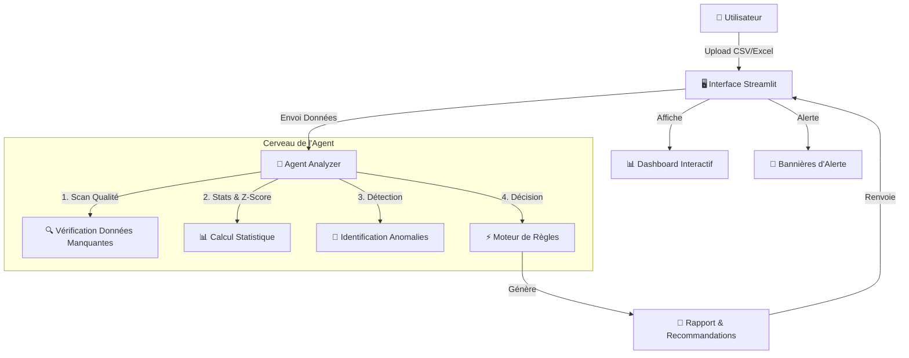

# 🤖 Agent Intelligent d'Analyse de Données

## 📝 Description du Système
Ce projet est un **Agent d'Analyse de Données** autonome conçu pour surveiller, analyser et détecter des anomalies dans des flux de données critiques (ventes, production, serveurs, finance).

Contrairement à un simple tableau de bord, cet agent agit comme un **auditeur virtuel** : il ne se contente pas d'afficher des chiffres, il **interprète** les données, identifie les problèmes urgents et propose des recommandations d'action.

---

## 🧠 Comment ça marche ? (Architecture)

Le système repose sur une architecture modulaire où l'Intelligence Artificielle (logique métier) est découplée de l'interface utilisateur.

### 1. L'Agent d'Analyse (`analyzer.py`)
C'est le "cerveau" du système. Il utilise des algorithmes statistiques avancés pour "scanner" les données :
*   **Détection Z-Score** : Repère les valeurs statistiquement aberrantes (anomalies).
*   **Analyse de Tendance** : Détecte les chutes brutales ou pics suspects (ex: -30% de ventes).
*   **Contrôle Qualité** : Vérifie l'intégrité des données (valeurs manquantes).
*   **Moteur de Règles** : Détermine le niveau d'urgence (Critique, Avertissement, Normal) et génère des recommandations textuelles.

### 2. L'Interface Utilisateur (`app.py`)
C'est la "voix" du système. Construite avec **Streamlit**, elle permet à l'utilisateur d'interagir avec l'agent :
*   Chargement simple des fichiers (Drag & Drop).
*   Configuration dynamique des seuils de sensibilité.
*   Visualisation riche (Graphiques Plotly interactifs).
*   Export des rapports d'audit.

---

## 🔄 Flux de Travail (Workflow)



---

## 🚀 Comment Lancer le Système

### Prérequis
*   Python 3.10 ou plus récent.

### 1. Installation
Ouvrez votre terminal dans le dossier du projet :
```bash
# Installer les dépendances
pip install -r requirements.txt
```

### 2. Démarrage
Lancez l'agent avec la commande suivante :
```bash
streamlit run app.py
```
> **Note :** Une fenêtre de navigateur s'ouvrira automatiquement à l'adresse `http://localhost:8501`.

---

## 📂 Jeux de Données de Test
Le projet inclut un dossier `datasets_test/` contenant des scénarios pré-configurés pour tester les réactions de l'agent :

| Fichier | Scénario | Réaction attendue |
| :--- | :--- | :--- |
| `ventes_normales.csv` | Activité standard | ✅ **NORMAL** |
| `ventes_crash.csv` | Chute brutale des ventes | 🚨 **CRITIQUE** |
| `serveurs_alert.csv` | Panne et latence élevée | 🚨 **CRITIQUE** |
| `production_quality.csv` | Hausse progressive des défauts | ⚠️ **AVERTISSEMENT** |
| `finance_anomalies.csv` | Montants suspects (Fraude) | ⚠️ **AVERTISSEMENT** / 🚨 |

---

## 🛠️ Outils Techniques
*   **Python** : Langage principal.
*   **Pandas / NumPy** : Manipulation et calcul haute performance.
*   **Streamlit** : Framework d'interface web rapide pour la Data Science.
*   **Plotly** : Bibliothèque de graphiques interactifs.
